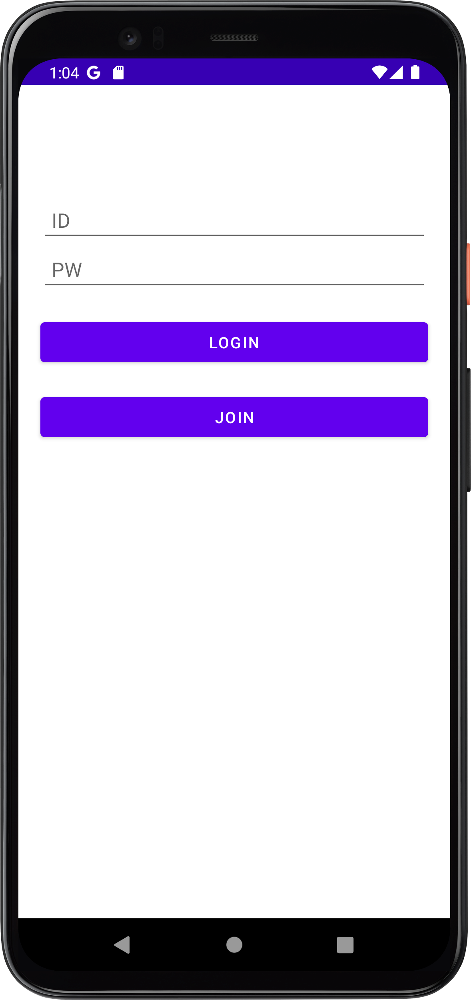
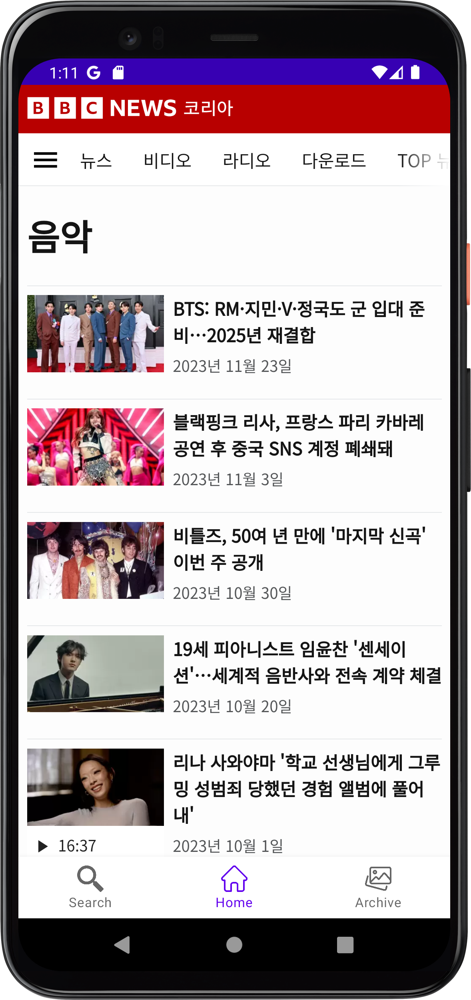
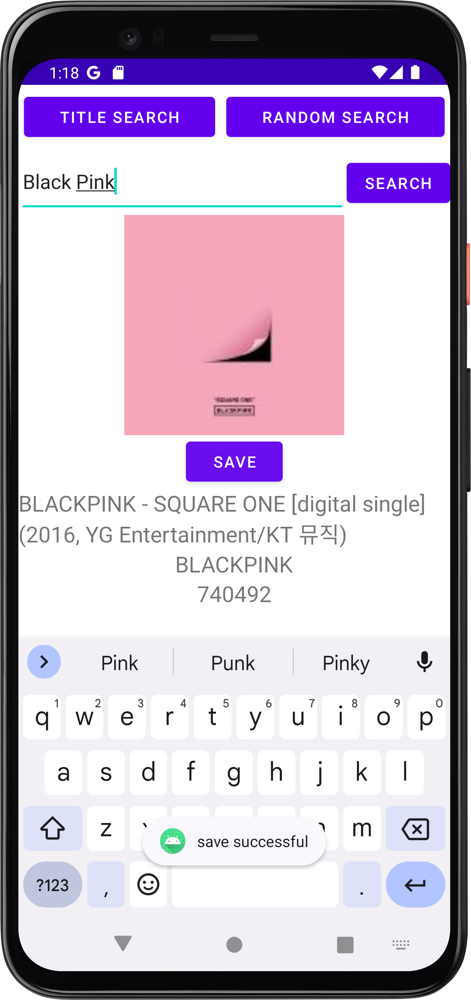
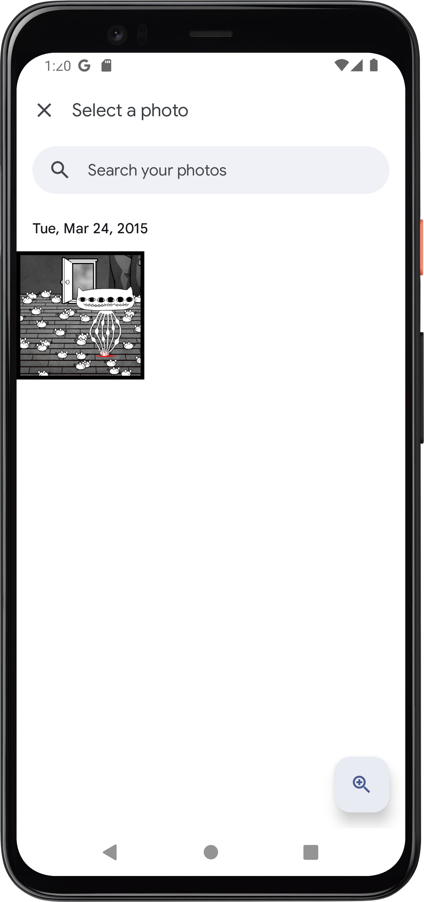
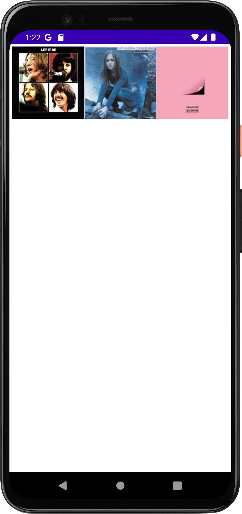
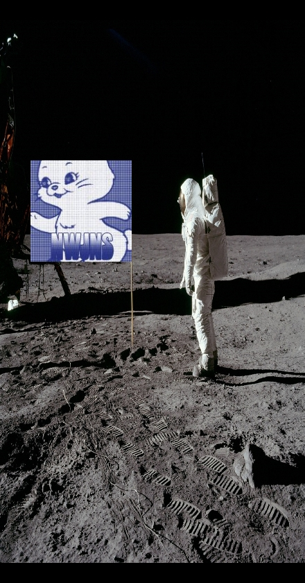

# Tech Stack

SDK 33 (min SDK 28) <- (Google policy change has to be followed)

API 33 Android 13.0 (Tiramisu)

Device : Pixel 4 API 33

Language : java

Networking : OkHttp

DataBase : maniadb, Firebase

## 1. login Page

## 2. Main Page

## 3. Album Search Page

## 4. Photo Chose Page

## 5.Album Chose Page

## 6. Result Example

